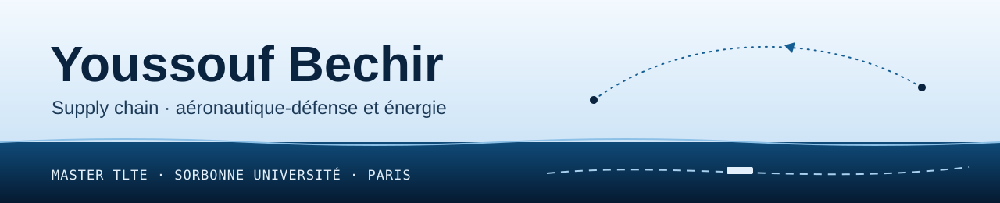

Je suis en Master TLTE (Transport, logistique, territoires, environnement) à Sorbonne Université et à l'École Supérieure des Transports, en alternance comme Pricing & Business Analyst chez GEODIS.

Je travaille sur la supply chain de deux industries : l'aéronautique-défense, où les moteurs et les pièces forgées freinent les cadences, et l'énergie, où une route maritime qui ferme change le prix de tout un voyage. Mon portfolio suit ces sujets avec des données publiques, sourcées et datées.

**[youssouf55.github.io](https://youssouf55.github.io/)**

[&suffix=%20%24%2Fb&color=155E93&style=flat-square)](https://youssouf55.github.io/)
[&color=155E93&style=flat-square)](https://youssouf55.github.io/)

Ces badges lisent les données du site, collectées toutes les six heures par une GitHub Action ([`veille.yml`](https://github.com/Youssouf55/youssouf55.github.io/blob/main/.github/workflows/veille.yml)) auprès du FMI (PortWatch), de la BCE et de l'EIA.

## Ce que je prépare

| | Question | Livrable | État |
|:--|:--|:--|:--|
| A1 | Combien coûte un avion qui attend ses moteurs ? | Modèle Excel et note de 4 pages | en préparation |
| A2 | Titane et pièces forgées : où sont les dépendances ? | Tableau de bord | prévue |
| A3 | Double usage 2026 : ce qui change pour un flux export | Note de 2 pages | prévue |
| E1 | Fermeture d'Ormuz : combien coûte un voyage de pétrolier ? | Modèle Excel, puis Python | prévue |
| E2 | Combien coûte l'attente au port ? | Calculateur de surestaries | en préparation |
| E3 | Force majeure au Qatar : où l'Europe trouve-t-elle son GNL ? | Note et carte | prévue |

Chaque étude dit pour qui elle est faite et ce qui pourrait la contredire. Les deux fiches de base (aéronautique-défense, énergie) sont [en ligne](https://youssouf55.github.io/#recherche).

## Projets de BUT

- [Phénix : la mer ou le rail pour l'automobile](https://github.com/Youssouf55/sae4-transport-international-automobile), flux multimodaux Marseille–Le Mans, maritime contre ferroviaire.
- [BES Électroménager : remplir un conteneur](https://github.com/Youssouf55/sae2-optimisation-chargement-bes), chargement d'un 40 pieds et politique de réapprovisionnement.
- [Plumbingstuff : un entrepôt en France après le Brexit](https://github.com/Youssouf55/sae6-implantation-entrepot-post-brexit), choix de site et cahier des charges WMS.
- [Tableau de bord d'entrepôt](https://github.com/Youssouf55/tableau-de-bord-kpis-entrepot), taux de service et productivité sur 25 à 30 tournées par jour.

Les autres dépôts reprennent des exercices de cours : stocks, tournées, externalisation, audit de chaîne.

## Parcours

| Période | Poste | Où |
|:--|:--|:--|
| 2026-2028 | Pricing & Business Analyst, alternance | GEODIS Distribution & Express, siège |
| 2024-2026 | Alternant opérations supply chain | U Logistique, Ifs |
| Été 2024 | Stagiaire achats et supply chain internationale | AGIT, forages soutenus par l'UNICEF, Tchad |
| Mai 2024 | Stagiaire commerce international et fret | World Transport Easy, Roissy-CDG |
| Été 2023 | Stagiaire coordination supply chain | Mosaic International, secteur énergie |

**Formation.** Master TLTE, Excellence in Sustainable Transportation, Sorbonne Université et École Supérieure des Transports (2026-2028). BUT Management de la logistique et des transports, IUT Grand Ouest Normandie (2023-2026).

**Outils.** Excel et VBA, Power BI, Python pour la collecte de données publiques. Incoterms, douane, affrètement.

**Langues.** Français, anglais (C1), arabe (C1).

**Engagements.** IRIS, Supply Chain+, bénévole logistique à l'UNICEF France.

---

[Portfolio](https://youssouf55.github.io/) · [LinkedIn](https://www.linkedin.com/in/youssouf-bechir-youssouf)
